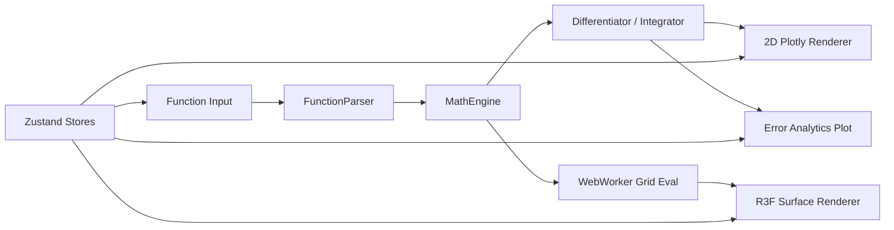

#  CalcVerse

[](https://react.dev/)
[](https://threejs.org/)
[](https://eric157.github.io/CalcVerse/)
[](https://eric157.github.io/CalcVerse/)

CalcVerse is a real-time mathematical universe engine for interactive graphing, calculus exploration, numerical analysis, and 3D surface investigation.

## Architecture



## Features

- 🚀 Multi-function Plotly 2D graphing with domain controls and derivative hover readouts
- 🔬 Calculus lab with tangent diagnostics and secant-to-tangent limit animation
- 🟦 Integral engine with animated Riemann sums and exact-vs-numerical comparison
- 🌐 3D explorer with worker-driven surfaces, gradient arrows, contours, slicing planes, and cross-section inset chart
- 🎬 Global animation engine (`t`) with play/pause/reset/speed controls
- 📊 Error analytics lab with log-log finite-difference error curves, optimal `h`, and configurable noise/smoothing
- ✨ Neon glow design system, Framer Motion transitions, and keyboard-driven interaction model

## Built-in Examples

- Gaussian Bell: `exp(-x^2)` (2D + derivative)
- Saddle Point: `x^2 - y^2` (3D + gradient)
- Ripple Wave: `sin(sqrt(x^2+y^2)) / sqrt(x^2+y^2)` (3D)
- Traveling Wave: `sin(x - t)` (2D animated)
- Butterfly Curve: `exp(cos(x)) - 2*cos(4x) - sin(x/12)^5` (2D)
- Periodic Gaussian: `sin(x)*exp(-x^2/10)` (2D + integral)

## Local Development

```bash
npm install
npm run dev
```

Optional strict type-check:

```bash
npm run typecheck
```

## GitHub Pages Deployment

```bash
npm run deploy
```

Notes:

- `vite.config.ts` uses `base: '/CalcVerse/'`
- `public/404.html` handles SPA fallback redirection
- `public/CNAME` and `public/.nojekyll` are included
- `postbuild` writes `dist/.nojekyll`

## Keyboard Shortcuts

| Key | Action |
|---|---|
| `Space` | Play / Pause animation |
| `R` | Reset animation to `t=0` |
| `G` | Toggle gradient arrows |
| `W` | Toggle wireframe |
| `C` | Toggle contour projection |
| `S` | Toggle slicing plane |
| `D` | Toggle derivative overlay |
| `I` | Toggle integral shading |
| `Tab` | Cycle function inputs |
| `Escape` | Close active panel |
| `Ctrl+Z` | Undo last function edit |
| `Ctrl+Enter` | Add new function |
| `F` | Fullscreen canvas |
| `?` | Show keyboard shortcut modal |

## Screenshots


## License

MIT